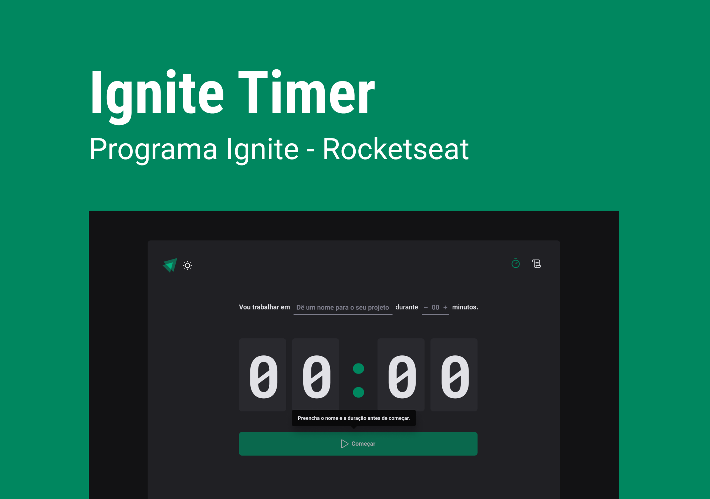

  

## This application allows you control the time for each task. Besides, you can see all the tasks that you've done and which one you completed or not

 

This website was created during the course Ignite to learn more about React JS

## 🧪 Technologies

This project was developed using de following technologies:

- [React](https://beta.reactjs.org/)
- [Styled components](https://styled-components.com/)
- [date-fns](https://date-fns.org/)
- [Typescript](https://www.typescriptlang.org/)
- [phosphor-icons](https://phosphoricons.com/)
- [React Hook Form](https://react-hook-form.com/)
- [Immer](https://immerjs.github.io/immer/)
- [Zod](https://zod.dev/)

## 🔖 Layout

You can view the project layout through the links below:

- [Layout](https://www.figma.com/community/file/1127351821076435124)

Remembering that you need to have a [Figma](http://figma.com/) account to access it.

 

Developed by [ricardorhv](https://github.com/ricardorhv) 👋
